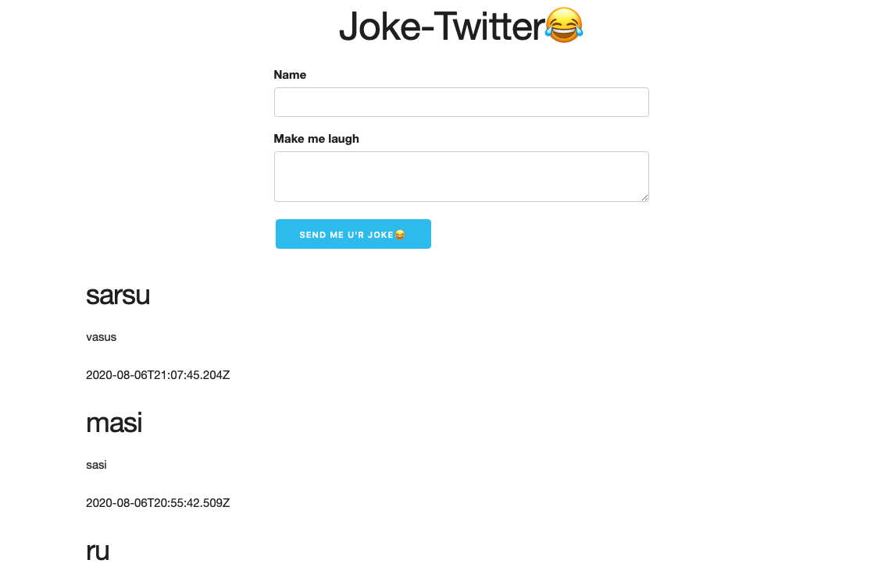

<p align="center">😂</p>
<h2 align="center">joke chat</h2>
<p align="center">
<strong>Simple project to do some joke chat</strong>
<br>

## Description

The project has 2 parts, the client part i.e the frontend part and the server part that is the backend part.

## client

Frontend part. Mainly the done with HTML, JavaScript and CSS.
#### run: ```using a lite-server```

## server

Backend part. Mainly the done with Nodejs, Express.
#### run: ```npm run dev```
### Libraries
1. monk : connect the mongodb
2. cors : to avoid cross-origin errors
3. express-rate-limit: to reduce the api call

## Database
mongodb database running in the local.
  > Start: brew services start mongodb-community@4.4
	> Stop: brew services stop mongodb-community@4.4
	> check database running:  ps aux | grep -v grep | grep mongod
	> connect to Database:  mongo 

